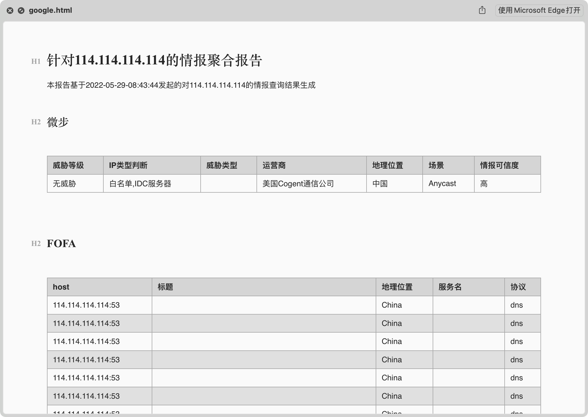

# inforgation蓝队信息聚合查询工具

### 某次蓝队值守时写的，没有算法基础，各种逻辑写得比较一般
### 特别感谢[狼组安全团队的TIG 威胁情报收集](https://github.com/wgpsec/tig#tig--%E5%A8%81%E8%83%81%E6%83%85%E6%8A%A5%E6%94%B6%E9%9B%86-) ,本工具也是在TIG的基础上进行开发，加入了更多平台的查询

# 由于接入平台的增多，不同平台的API响应速度会影响到查询速度，请根据自身需求配置APIKEY，APIKEY为空则不会通过该平台进行情报检索，目前已知对查询速度影响较大的API有shodan和zoomeye

### 新增批量查询，将需要查询的IP存放在文件中，一行一个，不正确的IP会浪费API请求次数。使用`-f`参数指定文件，若不使用绝对路径需要将文件放在项目目录下，使用批量查询时报告会将单个IP的查询结果以IP作为文件名输出至output目录下

ps:已知问题：shodan平台查询结果输出到报告时，会出现将特殊字符转义的情况（\n），因此临时用'、'替代，等后续版本更新

# inforgarion支持的平台如下：

## 鹰图
> [奇安信鹰图平台](https://hunter.qianxin.com/) 
> 
> [鹰图API获取地址](https://hunter.qianxin.com/home/userInfo)
## fofa
> [fofa平台](https://fofa.info/)
> 
> [fofa API获取地址](https://fofa.info/personalData)
## 微步
> [微步社区](https://x.threatbook.cn/)
> 
> [微步API获取地址](https://x.threatbook.cn/v5/myApi)
## shodan
> [shodan平台](https://www.shodan.io/)
> 
> [shodan API获取地址](https://account.shodan.io/)
## 0zero
> [0zero平台](https://0.zone/)
> 
> [0zero API获取地址](https://0.zone/applyParticulars?type=site)
## zoomeye

>[zoomeye 平台](https://www.zoomeye.org/)
>
>[zoomeye apiley获取地址](https://www.zoomeye.org/profile)

### and more......
# 使用方法：
1、clone至本地后首先安装依赖

`pip(3) install -r requirements.txt -i https://mirrors.aliyun.com/pypi/simple/
`

2、接着配置config.ini，往里面添加自己的APIKEY，config.ini如下：
```editorconfig
[鹰图/hunter]
# 鹰图地址：https://hunter.qianxin.com/
# 鹰图APIKEY获取地址：https://hunter.qianxin.com/home/userInfo
username = 
apikey = 

[fofa]
# fofa地址：https://fofa.info/
# fofa APIKEY获取地址：https://fofa.info/personalData
mail = 
apikey = 

[微步/weibu]
# 微步社区地址：https://x.threatbook.cn/
# 微步APIKEY获取地址：https://x.threatbook.cn/v5/myApi
apikey = 

[shodan]
# shodan地址：https://www.shodan.io/
# shodan APIKEY获取地址：https://account.shodan.io/
apikey = 

[0zero]
# 0zero地址：https://0.zone/
# 0zero APIKEY获取地址：https://0.zone/applyParticulars?type=site
apikey = 

[zoomeye]
# zoomeye地址：https://www.zoomeye.org/
# zoomeye APIKEY获取地址：https://www.zoomeye.org/profile
apikey=
```
3、运行：`python3 inforgation.py`，使用`-i`参数指定要查询的单个IP，使用`-o`参数指定输出的文件名，如：
`python3 inforgation.py -i 129.211.129.109 -o gogole`，运行结果如下：

```shell
 _        __                       _   _             
(_)_ __  / _| ___  _ __ __ _  __ _| |_(_) ___  _ __  
| | '_ \| |_ / _ \| '__/ _` |/ _` | __| |/ _ \| '_ \ 
| | | | |  _| (_) | | | (_| | (_| | |_| | (_) | | | |
|_|_| |_|_|  \___/|_|  \__, |\__,_|\__|_|\___/|_| |_|
Powered by Wrong-pixel |___/          version 1.1   
    
───────────────────────── [INFO] 正在鹰图上查询 129.211.129.109 的信息... ──────────────────────────
[INFO] 消耗积分：0
[INFO] 今日剩余积分：30622
┏━━━━━━━━━━━━━━━━━┳━━━━━━┳━━━━━━━━━━┳━━━━━━━━━━━━━━━┳━━━━━━━━┳━━━━━━━━━━┳━━━━━━━━━━━━━━━━━┳━━━━━━━━┓
┃ url             ┃ 端口  ┃ 网页标题  ┃ 域名           ┃ 状态码  ┃ 操作系统  ┃     归属地       ┃ 运营商  ┃
┡━━━━━━━━━━━━━━━━━╇━━━━━━╇━━━━━━━━━━╇━━━━━━━━━━━━━━━╇━━━━━━━━╇━━━━━━━━━━╇━━━━━━━━━━━━━━━━━╇━━━━━━━━┩
│ http://playaga… │ 80   │ 温馨提示 │ playagame.xyz │  200   │   N/A    │ 中国上海市上海… │  腾讯  │
│ http://www.44i… │ 80   │ 温馨提示 │ www.44iv.com  │  200   │   N/A    │ 中国上海市上海… │  腾讯  │
│ http://www.623… │ 80   │ 温馨提示 │ www.62335.com │  200   │   N/A    │ 中国上海市上海… │  腾讯  │
│ http://li64.com │ 80   │ 温馨提示 │ li64.com      │  200   │   N/A    │ 中国上海市上海… │  腾讯  │
│ https://playag… │ 443  │ N/A     │ playagame.xyz │   0    │   N/A    │ 中国上海市上海… │  腾讯  │
│ https://li64.c… │ 443  │ N/A     │ li64.com      │   0    │   N/A    │ 中国上海市上海… │  腾讯  │
│ https://www.44… │ 443  │ N/A     │ www.44iv.com  │   0    │   N/A    │ 中国上海市上海… │  腾讯  │
│ https://www.62… │ 443  │ N/A     │ www.62335.com │   0    │   N/A    │ 中国上海市上海… │  腾讯  │
│ http://pay.kgm… │ 80   │ 温馨提示 │ pay.kgml.cc   │  200   │   N/A    │ 中国上海市上海… │  腾讯  │
│ http://by.kgml… │ 80   │ 温馨提示 │ by.kgml.cc    │  200   │   N/A    │ 中国上海市上海… │  腾讯  │
└─────────────────┴──────┴─────────┴───────────────┴────────┴──────────┴──────────────┴────────┘
───────────────────────── [INFO] 正在FOFA上查询 129.211.129.109 的信息... ──────────────────────────
┏━━━━━━━━━━━━━━━━━━━━━━━━━━━━━┳━━━━━━━━━━━━━━━━━━━━━━━┳━━━━━━━━━━┳━━━━━━━━━━━━━━┳━━━━━━━┓
┃ host                        ┃ 标题                   ┃ 地理位置  ┃ 服务名        ┃ 协议   ┃
┡━━━━━━━━━━━━━━━━━━━━━━━━━━━━━╇━━━━━━━━━━━━━━━━━━━━━━━╇━━━━━━━━━━╇━━━━━━━━━━━━━━╇━━━━━━━┩
│ 129.211.129.109:80          │                       │ China    │ nginx/1.14.0 │ http  │
│ https://129.211.129.109:443 │                       │ China    │ nginx/1.14.0 │ https │
│ 129.211.129.109             │ 301 Moved Permanently │ China    │ nginx/1.14.0 │ http  │
│ www.4399.net                │ 301 Moved Permanently │ China    │ nginx/1.14.0 │ http  │
│ 4399.com                    │ 301 Moved Permanently │ China    │ nginx/1.14.0 │ http  │
│ https://4399.com            │ 301 Moved Permanently │ China    │ nginx/1.14.0 │ https │
│ https://129.211.129.109     │ 301 Moved Permanently │ China    │ nginx/1.14.0 │ https │
│ wwww.4399.com               │ 301 Moved Permanently │ China    │ nginx/1.14.0 │ http  │
│ https://wwww.4399.com       │ 301 Moved Permanently │ China    │ nginx/1.14.0 │ https │
│ 129.211.129.109:80          │                       │ China    │              │ http  │
│ https://129.211.129.109:443 │                       │ China    │              │ https │
│ ww.4399.com                 │ 301 Moved Permanently │ China    │ nginx/1.14.0 │ http  │
└─────────────────────────────┴───────────────────────┴──────────┴──────────────┴───────┘
─────────────────────── [INFO] 正在微步上查询 129.211.129.109 的威胁情报... ────────────────────────
┏━━━━━━━━━━┳━━━━━━━━━━━━━━━━━━┳━━━━━━━━━━━━┳━━━━━━━━┳━━━━━━━━━━━━━━━━━━━┳━━━━━━━━━━┳━━━━━━━━━━━━┓
┃ 威胁等级  ┃    IP类型判断     ┃  威胁类型    ┃ 运营商  ┃     地理位置       ┃   场景    ┃ 情报可信度   ┃
┡━━━━━━━━━━╇━━━━━━━━━━━━━━━━━━╇━━━━━━━━━━━━╇━━━━━━━━╇━━━━━━━━━━━━━━━━━━━╇━━━━━━━━━━╇━━━━━━━━━━━━┩
│  无威胁   │ 白名单,IDC服务器   │ 腾讯云主机   │  腾讯  │ 中国 上海市上海市    │ 数据中心   │     高     │
└──────────┴──────────────────┴────────────┴────────┴───────────────────┴──────────┴────────────┘
──────────────────────── [INFO] 正在shodan上查询 129.211.129.109 的信息... ─────────────────────────
┏━━━━━━━━━━━━━━━━━┳━━━━━━━━━━━━┳━━━━━━━━━━━━┳━━━━━━━━━━┳━━━━━━━━━━━━━━━━━━━━━━━━━━━━━━━━━━━━━━━━━━━┓
┃       IP        ┃ 开放的端口   ┃ 域名       ┃ 子域名     ┃ 运营商                                    ┃
┡━━━━━━━━━━━━━━━━━╇━━━━━━━━━━━━╇━━━━━━━━━━━━╇━━━━━━━━━━╇━━━━━━━━━━━━━━━━━━━━━━━━━━━━━━━━━━━━━━━━━━━┩
│ 129.211.129.109 │ 80、443    │ 4399.com、 │ 4399.com │ Shenzhen Tencent Computer Systems Company │
│                 │            │            │          │ Limited                                   │
└─────────────────┴────────────┴────────────┴──────────┴───────────────────────────────────────────┘
─────────────────────── [INFO] 正在0zero上查询 129.211.129.109 的威胁情报... ───────────────────────
[WARNING] 没有在0zero平台查询到相关信息!

──────────────────────── [INFO] 正在zoomeye上查询 129.211.129.109 的信息... ────────────────────────
┏━━━━━━━━━━━━━━━━━┳━━━━━━━━━┳━━━━━━━┳━━━━━━━━━━━━━━━┳━━━━━━━━━━━━━━━━━━━━━━━━━━━━━━━━━━━━━━━━━━━━━━┓
┃ IP              ┃ 应用     ┃ 端口   ┃ 服务          ┃ 服务标题                                      ┃
┡━━━━━━━━━━━━━━━━━╇━━━━━━━━━╇━━━━━━━╇━━━━━━━━━━━━━━━╇━━━━━━━━━━━━━━━━━━━━━━━━━━━━━━━━━━━━━━━━━━━━━━┩
│ 129.211.129.109 │ nginx   │ 443   │ https         │ 301 Moved Permanently                        │
│ 129.211.129.109 │ nginx   │ 80    │ http          │ \xd0\xa1\xd3\xce\xcf\xb7,4399\xd0\xa1\xd3\x… │
│                 │         │       │               │ - www.4399.com                               │
│ 129.211.129.109 │ nginx   │ 10443 │ http          │                                              │
│ 129.211.129.109 │         │ 3389  │ ms-wbt-server │                                              │
│ 129.211.129.109 │ OpenSSH │ 22    │ ssh           │                                              │
└─────────────────┴─────────┴───────┴───────────────┴──────────────────────────────────────────────┘
──────────────────────────────────────── [INFO]域名结果汇总 ────────────────────────────────────────
┏━━━━━━━━━━━━━━━┓
┃ IP绑定的域名    ┃
┡━━━━━━━━━━━━━━━┩
│ www.4399.net  │
│ wwww.4399.com │
│ www.44iv.com  │
│ playagame.xyz │
│ www.62335.com │
│ pay.kgml.cc   │
│ by.kgml.cc    │
│ ww.4399.com   │
│ li64.com      │
│ 4399.com      │
└───────────────┘
```


查询完毕后会在output目录中生成google.html的查询报告，如果使用`-o`指定文件名，则会在output目录下以IP跟时间为名生成报告，报告如下：



# TODO
- [ ] 批量查询
- [ ] 算法优化（看到一大堆if else自己都头大）
- [ ] 情报聚合后的去重
- [ ] 域名反查、whois查询
- [ ] 添加更多平台查询

# 最后，欢迎各位师傅提issue！万分感谢🙏
